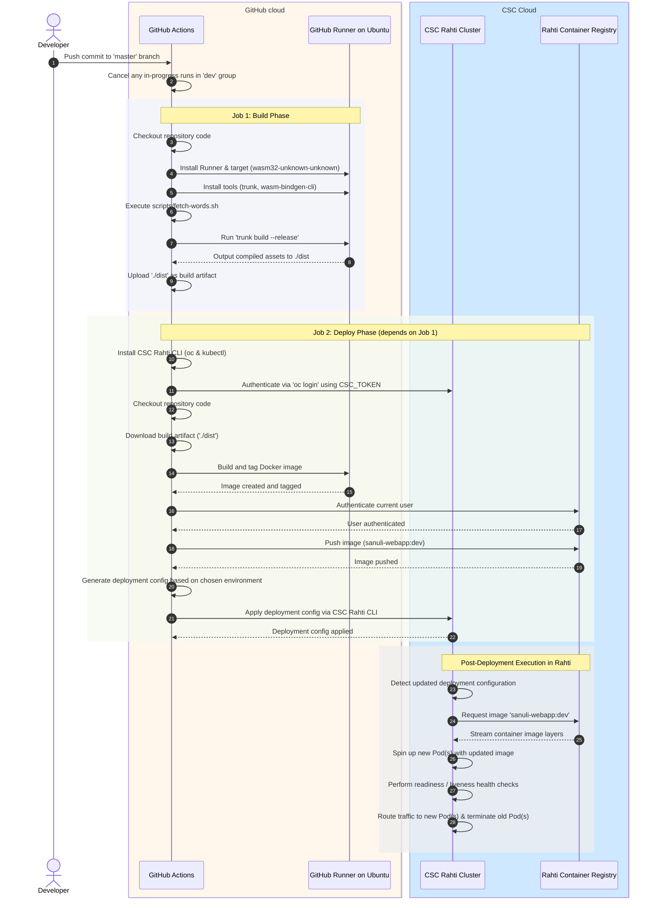
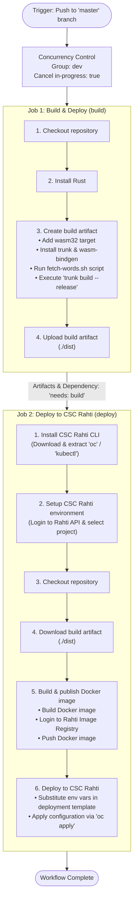
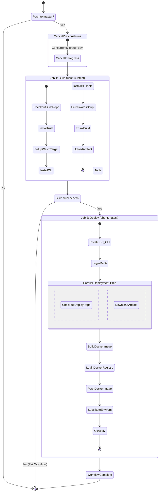

## Sequence diagram

-   Triggering & Concurrency: Commits pushed to master cause GitHub Actions to cancel active runs before kicking off the workflow.
-   Job 1 (Build): Interacts with Rust tools to compile WebAssembly assets and stores the resulting ./dist artifact within GitHub.
-   Job 2 (Deploy): Handshakes directly with the CSC Rahti Cluster (for authentication and OpenShift manifest deployment) and the Rahti Container Registry (to store the newly built Docker container image).
-   Deployment Detection: OpenShift/Rahti receives the updated deployment.yml manifest from the CI runner and triggers a new rolling deployment.
-   Image Pull: The cluster controller requests and pulls the updated sanuli-webapp:dev container image layers from the Rahti Container Registry.
-   Pod Lifecycle & Traffic Routing: Rahti provisions the new Pods, verifies their health, updates service routing, and safely terminates the legacy Pods.

## Flowchart

1.  Trigger & Concurrency Control:
    -   Trigger: Runs automatically on any push to the master branch.
    -   Concurrency: Prevents overlapping runs in the dev environment by automatically canceling any previously running workflow when a new push occurs.
2.  Job 1: build
    -   Prepares the Rust/WebAssembly environment.
    -   Compiles the application into web artifacts using trunk build --release.
    -   Uploads the generated ./dist directory as a GitHub Actions artifact.
3.  Job 2: deploy
    -   Dependency: Runs only after the build job completes successfully (needs: build).
    -   Environment & Credentials: Authenticates against CSC Rahti using CSC_TOKEN and CSC_PROJECT secrets.
    -   Docker & Deployment: Downloads the ./dist artifact, builds a Docker image, pushes it to the Rahti Image Registry, processes the deployment YAML template via envsubst, and applies it to OpenShift/Rahti using oc apply.

## Activity diagram

-   Guard Conditions: The workflow evaluates the git push branch event. If it hits master, it cancels any existing in-progress run under the dev concurrency group before starting.
-   Job Dependency: The deploy job enforces strict execution ordering using needs: build, meaning deployment will immediately abort if the build step fails.
-   Deployment Execution: Prepares necessary setup steps (like CLI tools and authentication) before pulling the built static files and repository files, building the Docker container image, and applying the environment configuration via OpenShift/Rahti CLI (oc apply).